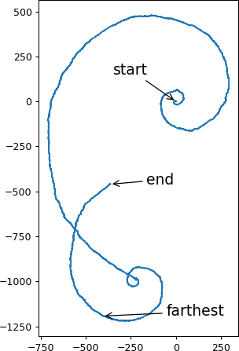
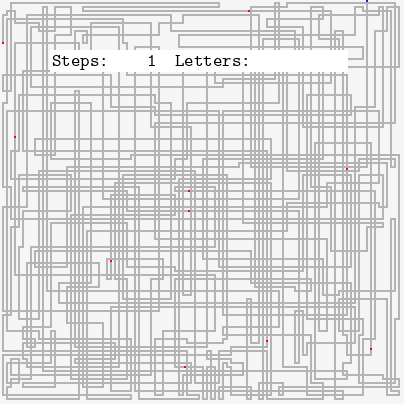
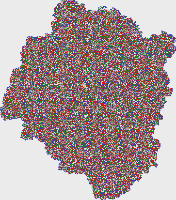
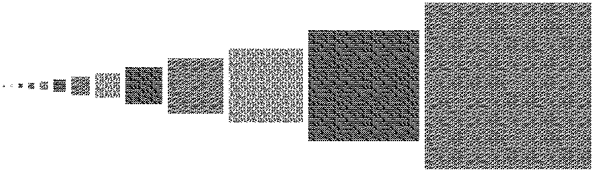

# Advent of code 2017

[[**Open the notebook in Colab**]](https://colab.research.google.com/github/hhoppe/advent_of_code/blob/main/2017/advent_of_code_2017.ipynb)

Jupyter [notebook](https://github.com/hhoppe/advent_of_code/blob/main/2017/advent_of_code_2017.ipynb)
with Python solutions to the
[2017 Advent of Code puzzles](https://adventofcode.com/2017),
completed in November 2022,
by [Hugues Hoppe](https://hhoppe.com/).

The notebook presents both "compact" and "fast" code versions, along with data visualizations.

For the fast solutions, the cumulative time across all 25 puzzles is less than 2 s on my PC. 
(Some solutions use the `numba` package to jit-compile functions, which can take a few seconds.)

Here are some visualization results:

day11  &emsp;
day14 

day19  &emsp;
day22 

day21 

