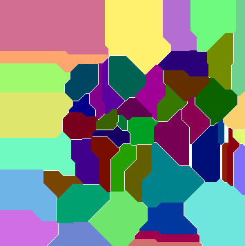

# Advent of code 2018

[[**Open the notebook in Colab**]](https://colab.research.google.com/github/hhoppe/advent_of_code/blob/main/2018/advent_of_code_2018.ipynb)

Jupyter [notebook](https://github.com/hhoppe/advent_of_code/blob/main/2018/advent_of_code_2018.ipynb)
with Python solutions to the
[2018 Advent of Code puzzles](https://adventofcode.com/2018),
completed in November 2021,
by [Hugues Hoppe](http://hhoppe.com/).

The notebook presents both "compact" and "fast" code versions, along with data visualizations.

For the fast solutions, the cumulative time across all 25 puzzles is less than 3 s on my PC. 
(Some solutions use the `numba` package to jit-compile functions, which can take a few seconds.)

Here are some visualization results:

day3 &emsp;
day6 &emsp;
day10 

day11 &emsp;
day12 &emsp;
day13 

day15 

day17 

day18 
&emsp;
day20 

day22 

