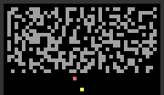
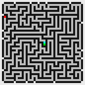
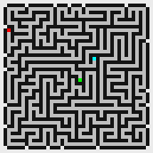
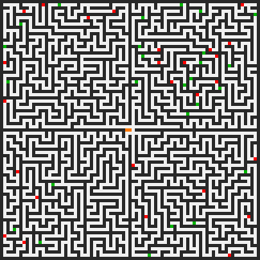
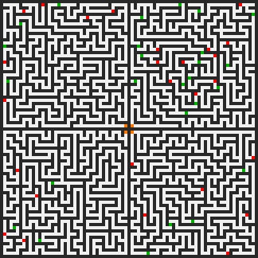
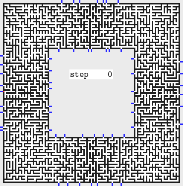
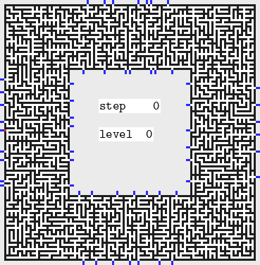

# Advent of code 2019

[[**Open the notebook in Colab**]](https://colab.research.google.com/github/hhoppe/advent_of_code/blob/main/2019/advent_of_code_2019.ipynb)

Jupyter [notebook](https://github.com/hhoppe/advent_of_code/blob/main/2019/advent_of_code_2019.ipynb)
with Python solutions to the
[2019 Advent of Code puzzles](https://adventofcode.com/2019),
completed in March 2021,
by [Hugues Hoppe](http://hhoppe.com/).

The notebook presents both "compact" and "fast" code versions, along with data visualizations.

For the fast solutions, the cumulative time across all 25 puzzles is less than 2 s on my PC. 
(Some solutions use the `numba` package to jit-compile functions, which can take a few seconds.)

Here are some visualization results:

day10 &emsp;
day11 

day13 &emsp;
day15 

day17 
day18 
&emsp;
day19 

day20 
&emsp;
day24 

