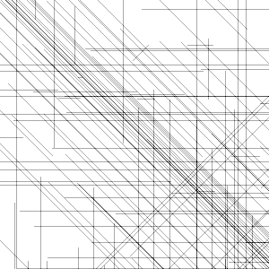
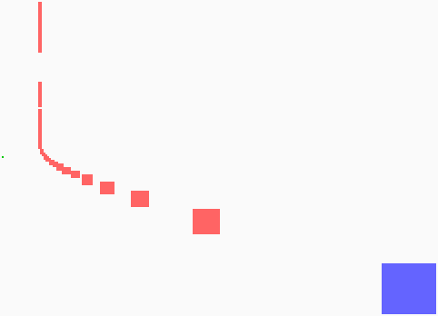
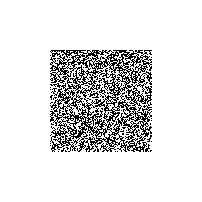
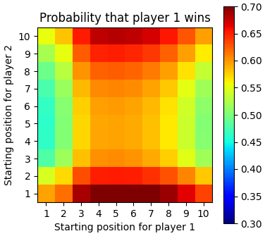

# Advent of code 2021

[[**Open the notebook in Colab**]](https://colab.research.google.com/github/hhoppe/advent_of_code/blob/main/2021/advent_of_code_2021.ipynb)

Jupyter [notebook](https://github.com/hhoppe/advent_of_code/blob/main/2021/advent_of_code_2021.ipynb)
with Python solutions to the
[2021 Advent of Code puzzles](https://adventofcode.com/2021),
completed in December 2021,
by [Hugues Hoppe](http://hhoppe.com/).

See [reddit](https://www.reddit.com/r/adventofcode/comments/rtx354/advent_of_code_2021_notebook_of_compact_and_fast/).

The notebook presents both "compact" and "fast" code versions, along with data visualizations.

For the fast solutions, the cumulative time across all 25 puzzles is less than 1 s on my PC. 
(Some solutions use the `numba` package to jit-compile functions, which can take a few seconds.)

Here are some visualization results:

<a href="#day5">day5</a> &emsp;
<a href="#day9">day9</a> &emsp;
<a href="#day11">day11</a> 

<a href="#day13">day13</a> &emsp;
<a href="#day15">day15</a> 

<a href="#day17">day17</a> &emsp;
<a href="#day20">day20</a> 

<a href="#day21">day21</a> &emsp;
<a href="#day23">day23</a> &emsp;
<a href="#day25">day25</a> 

