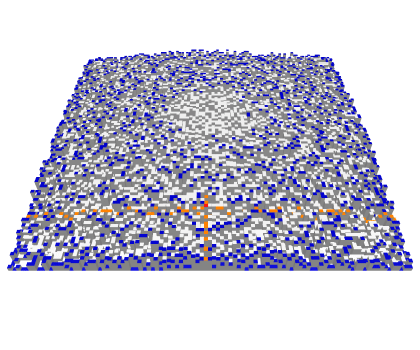
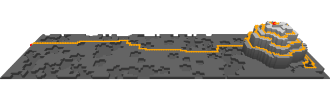
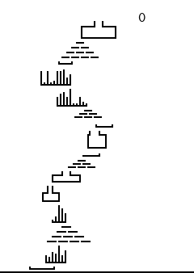
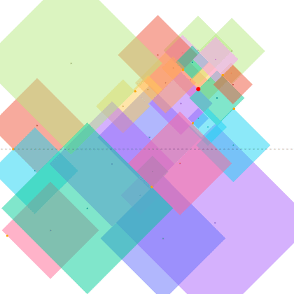
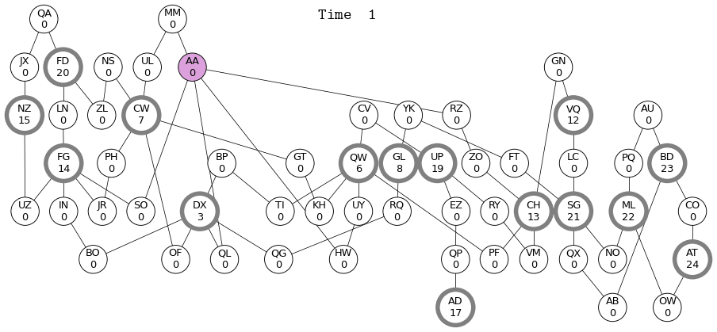
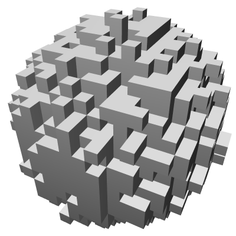
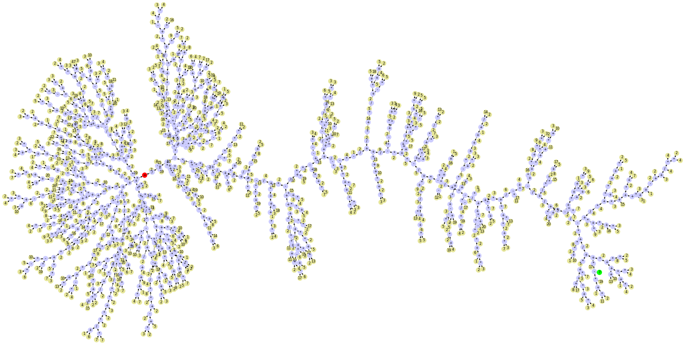
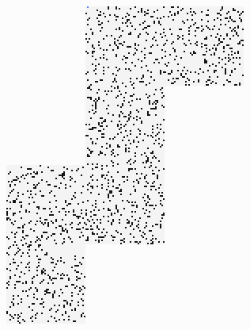
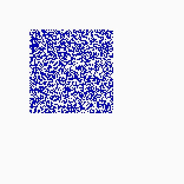

# Advent of code 2022

[[**Open the notebook in Colab**]](https://colab.research.google.com/github/hhoppe/advent_of_code/blob/main/2022/advent_of_code_2022.ipynb)

Jupyter [notebook](https://github.com/hhoppe/advent_of_code/blob/main/2022/advent_of_code_2022.ipynb)
with Python solutions to the
[2022 Advent of Code puzzles](https://adventofcode.com/2022),
completed in December 2022,
by [Hugues Hoppe](http://hhoppe.com/).

See [reddit](https://www.reddit.com/r/adventofcode/comments/108taz7/2022_advent_notebook_with_gif_visualizations/).

The notebook presents both "compact" and "fast" code versions, along with data visualizations.

For the fast solutions, the cumulative time across all 25 puzzles is less than 1 s on my PC. 
(Some solutions use the `numba` package to jit-compile functions, which can take a few seconds.)

Here are some visualization results (obtained by setting `SHOW_BIG_MEDIA = True`):

<a href="#day8">day8</a> &emsp;
<a href="#day9">day9</a> &emsp;
<a href="#day12">day12</a> 

<a href="#day14">day14</a> &emsp;
<a href="#day15">day15</a> &emsp;
<a href="#day16">day16</a> 

<a href="#day17">day17</a> &emsp;
<a href="#day18">day18</a> 
&emsp;
<a href="#day21">day21</a> 

<a href="#day22">day22</a> &emsp;
<a href="#day23">day23</a> &emsp;
<a href="#day24">day24</a> &nbsp;

