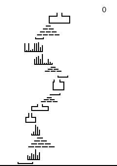
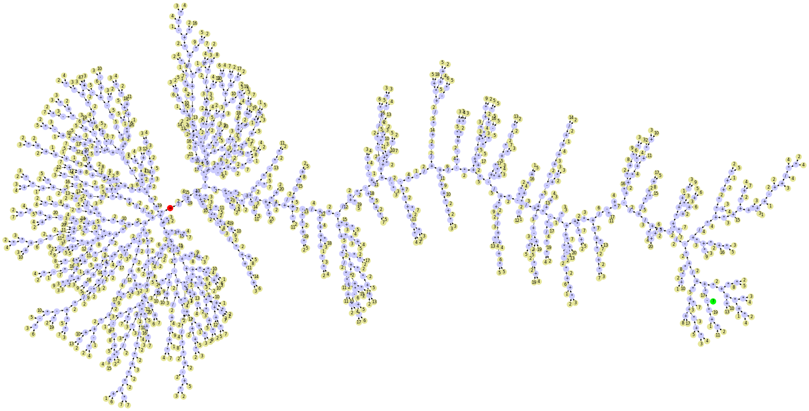
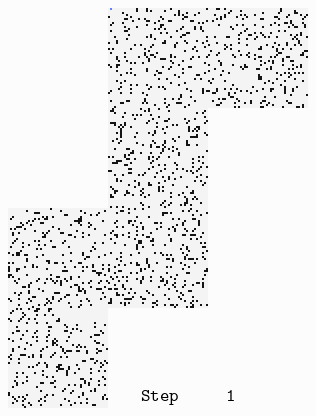
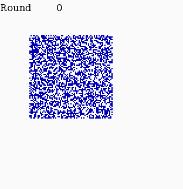

# Advent of code 2022

[[**Open the notebook in Colab**]](https://colab.research.google.com/github/hhoppe/advent_of_code/blob/main/2022/advent_of_code_2022.ipynb)

Jupyter [notebook](https://github.com/hhoppe/advent_of_code/blob/main/2022/advent_of_code_2022.ipynb)
with Python solutions to the
[2022 Advent of Code puzzles](https://adventofcode.com/2022),
completed in December 2022,
by [Hugues Hoppe](http://hhoppe.com/).

See [reddit](https://www.reddit.com/r/adventofcode/comments/108taz7/2022_advent_notebook_with_gif_visualizations/).

The notebook presents both "compact" and "fast" code versions, along with data visualizations.

For the fast solutions, the cumulative time across all 25 puzzles is less than 1 s on my PC. 
(Some solutions use the `numba` package to jit-compile functions, which can take a few seconds.)

Here are some visualization results (obtained by setting `SHOW_BIG_MEDIA = True`):

day8 &emsp;
day9 &emsp;
day12 

day14 &emsp;
day15 &emsp;
day16 

day17 &emsp;
day18 
&emsp;
day21 

day22 &emsp;
day23 &emsp;
day24 &nbsp;

