# Advent of code 2023

[[**Open the notebook in Colab**]](https://colab.research.google.com/github/hhoppe/advent_of_code/blob/main/2023/advent_of_code_2023.ipynb)

Jupyter [notebook](https://github.com/hhoppe/advent_of_code/blob/main/2023/advent_of_code_2023.ipynb)
with Python solutions to the
[2023 Advent of Code puzzles](https://adventofcode.com/2023),
completed in December 2023,
by [Hugues Hoppe](http://hhoppe.com/).

The notebook presents both "compact" and "fast" code versions, along with data visualizations.

For the fast solutions, the cumulative time across all 25 puzzles is less than 1 s on my PC. 
(Some solutions use the `numba` package to jit-compile functions, which can take a few seconds.)

Here are some visualization results (obtained by setting `SHOW_BIG_MEDIA = True`):

<a href="https://nbviewer.org/github/hhoppe/advent_of_code/blob/main/2023/advent_of_code_2023.ipynb#day3">day3</a>
 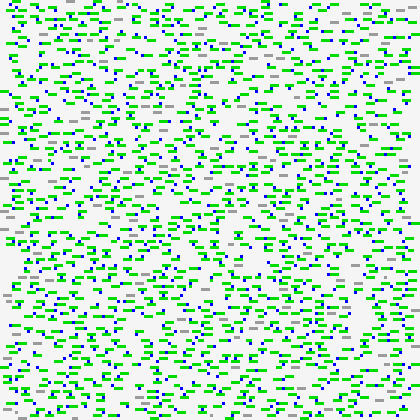&nbsp;
 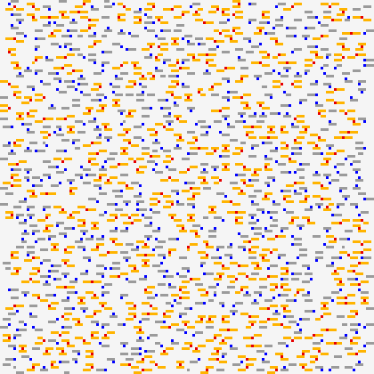&emsp;
<a href="https://nbviewer.org/github/hhoppe/advent_of_code/blob/main/2023/advent_of_code_2023.ipynb#day6">day6</a>
 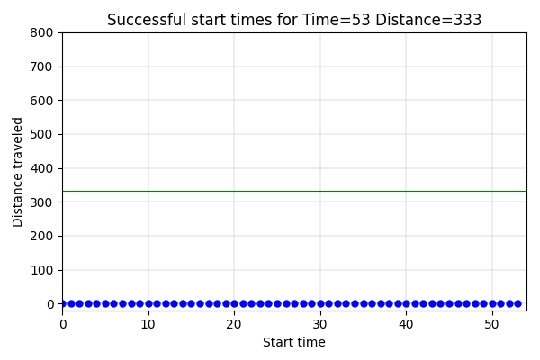&emsp;
<a href="https://nbviewer.org/github/hhoppe/advent_of_code/blob/main/2023/advent_of_code_2023.ipynb#day7">day7</a>
 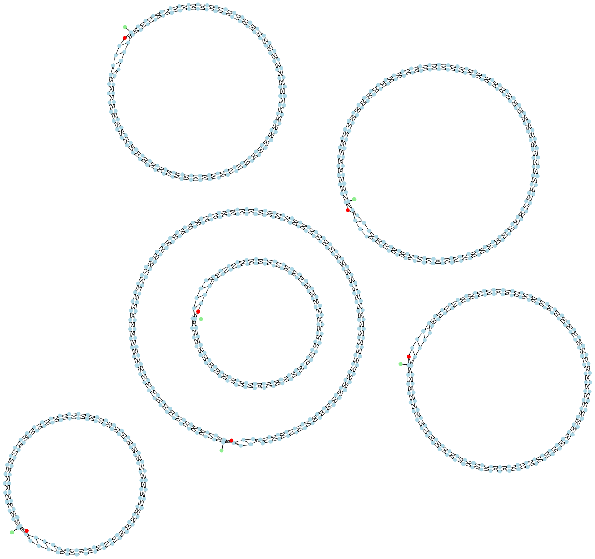

<a href="https://nbviewer.org/github/hhoppe/advent_of_code/blob/main/2023/advent_of_code_2023.ipynb#day10">day10</a>
 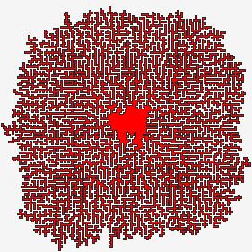&nbsp;
 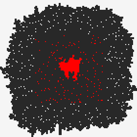&emsp;
<a href="https://nbviewer.org/github/hhoppe/advent_of_code/blob/main/2023/advent_of_code_2023.ipynb#day13">day13</a>
 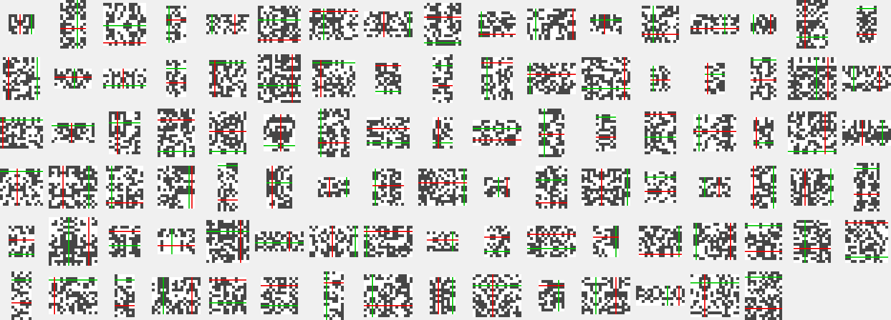&emsp;
<a href="https://nbviewer.org/github/hhoppe/advent_of_code/blob/main/2023/advent_of_code_2023.ipynb#day14">day14</a>
 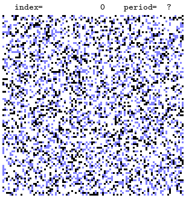

<a href="https://nbviewer.org/github/hhoppe/advent_of_code/blob/main/2023/advent_of_code_2023.ipynb#day16">day16</a>
 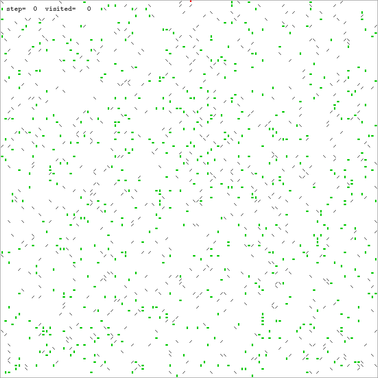&emsp;
<a href="https://nbviewer.org/github/hhoppe/advent_of_code/blob/main/2023/advent_of_code_2023.ipynb#day17">day17</a>
 &nbsp;
 &emsp;
<a href="https://nbviewer.org/github/hhoppe/advent_of_code/blob/main/2023/advent_of_code_2023.ipynb#day18">day18</a>
 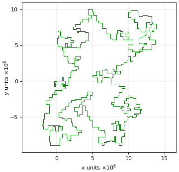

<a href="https://nbviewer.org/github/hhoppe/advent_of_code/blob/main/2023/advent_of_code_2023.ipynb#day20">day20</a>
 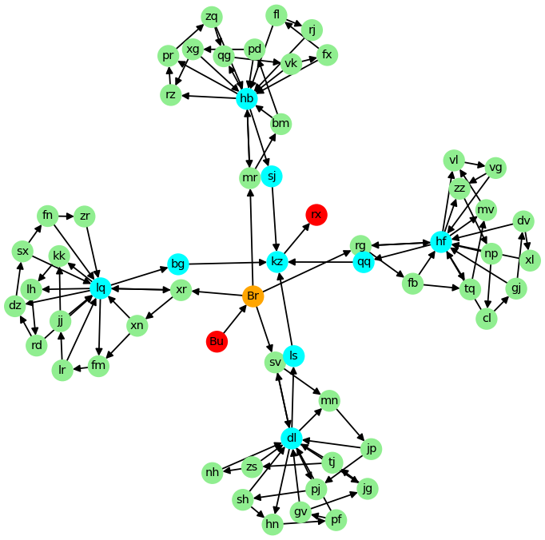&emsp;
<a href="https://nbviewer.org/github/hhoppe/advent_of_code/blob/main/2023/advent_of_code_2023.ipynb#day21">day21</a>
 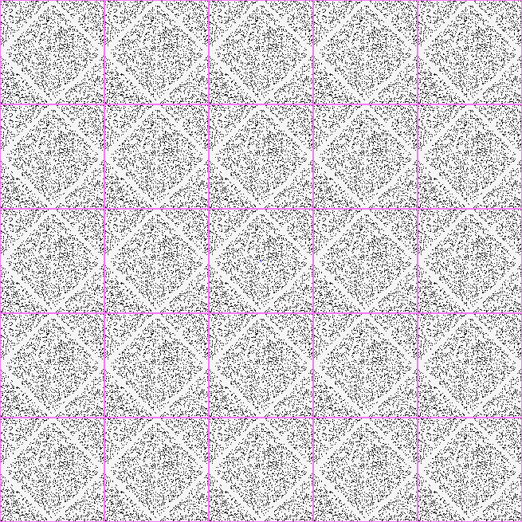&emsp;
<a href="https://nbviewer.org/github/hhoppe/advent_of_code/blob/main/2023/advent_of_code_2023.ipynb#day22">day22</a>
 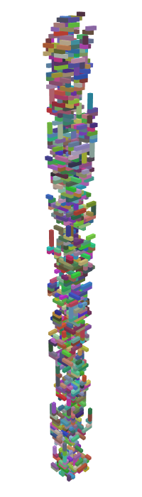&nbsp;
 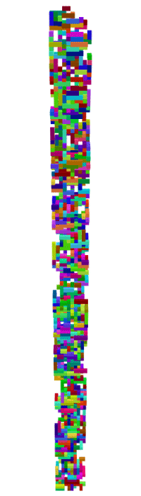

<a href="https://nbviewer.org/github/hhoppe/advent_of_code/blob/main/2023/advent_of_code_2023.ipynb#day23">day23</a>
 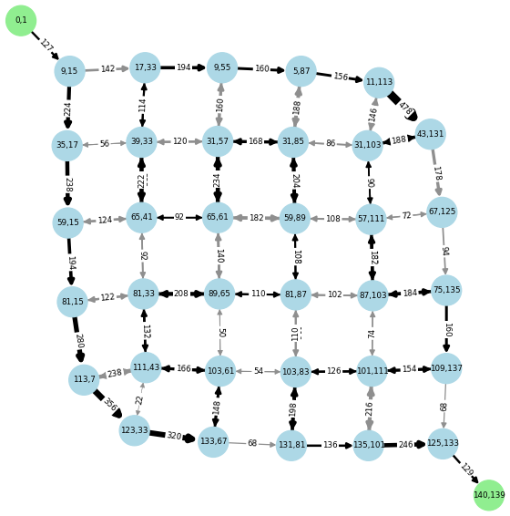&nbsp;
 &emsp;
<a href="https://nbviewer.org/github/hhoppe/advent_of_code/blob/main/2023/advent_of_code_2023.ipynb#day25">day25</a>
 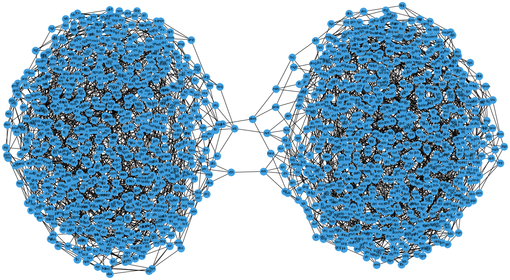

