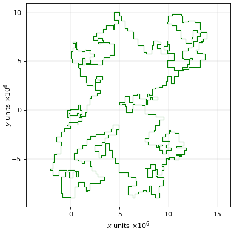

# Advent of code 2023

[[**Open the notebook in Colab**]](https://colab.research.google.com/github/hhoppe/advent_of_code/blob/main/2023/advent_of_code_2023.ipynb)

Jupyter [notebook](https://github.com/hhoppe/advent_of_code/blob/main/2023/advent_of_code_2023.ipynb)
with Python solutions to the
[2023 Advent of Code puzzles](https://adventofcode.com/2023),
completed in December 2023,
by [Hugues Hoppe](http://hhoppe.com/).

The notebook presents both "compact" and "fast" code versions, along with data visualizations.

For the fast solutions, the cumulative time across all 25 puzzles is less than 1 s on my PC. 
(Some solutions use the `numba` package to jit-compile functions, which can take a few seconds.)

Here are some visualization results (obtained by setting `SHOW_BIG_MEDIA = True`):

day3 &nbsp;
&emsp;
day6 &emsp;
day7 

day10 &nbsp;
&emsp;
day13 &emsp;
day14 

day16 &emsp;
day17 &nbsp;
&emsp;
day18 

day20 &emsp;
day21 &emsp;
day22 &nbsp;

day23 &nbsp;
&emsp;
day25 

