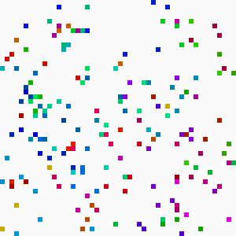
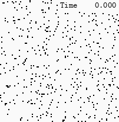
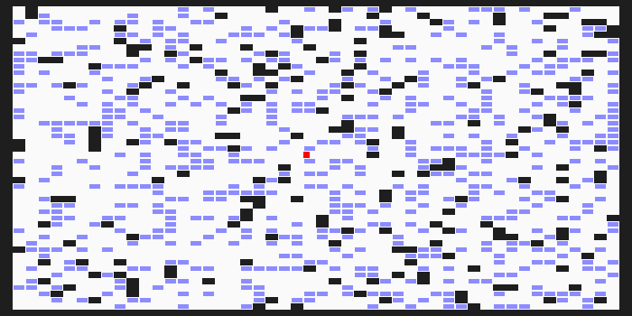
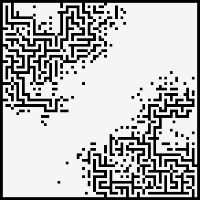
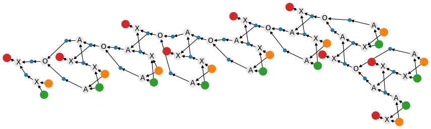

# Advent of code 2024

[[**Open the notebook in Colab**]](https://colab.research.google.com/github/hhoppe/advent_of_code/blob/main/2024/advent_of_code_2024.ipynb)

Jupyter [notebook](https://github.com/hhoppe/advent_of_code/blob/main/2024/advent_of_code_2024.ipynb)
with Python solutions to the
[2024 Advent of Code puzzles](https://adventofcode.com/2024),
completed in December 2024,
by [Hugues Hoppe](http://hhoppe.com/).

The notebook presents both "compact" and "fast" code versions, along with data visualizations.

For the fast solutions, the cumulative time across all 25 puzzles is less than 0.5 s on my PC. 
(Some solutions use the `numba` package to jit-compile functions, which can take a few seconds.)

Here are some visualization results (obtained by setting `SHOW_BIG_MEDIA = True`):

<a href="https://nbviewer.org/github/hhoppe/advent_of_code/blob/main/2024/advent_of_code_2024.ipynb#day4">day4</a>
 &emsp;
<a href="https://nbviewer.org/github/hhoppe/advent_of_code/blob/main/2024/advent_of_code_2024.ipynb#day6">day6</a>
 &emsp;
<a href="https://nbviewer.org/github/hhoppe/advent_of_code/blob/main/2024/advent_of_code_2024.ipynb#day8">day8</a>
 

<a href="https://nbviewer.org/github/hhoppe/advent_of_code/blob/main/2024/advent_of_code_2024.ipynb#day9">day9</a>
 &emsp;
<a href="https://nbviewer.org/github/hhoppe/advent_of_code/blob/main/2024/advent_of_code_2024.ipynb#day12">day12</a>
 &emsp;
<a href="https://nbviewer.org/github/hhoppe/advent_of_code/blob/main/2024/advent_of_code_2024.ipynb#day14">day14</a>
 

<a href="https://nbviewer.org/github/hhoppe/advent_of_code/blob/main/2024/advent_of_code_2024.ipynb#day15">day15</a>
 &emsp;
<a href="https://nbviewer.org/github/hhoppe/advent_of_code/blob/main/2024/advent_of_code_2024.ipynb#day16">day16</a>
 

<a href="https://nbviewer.org/github/hhoppe/advent_of_code/blob/main/2024/advent_of_code_2024.ipynb#day18">day18</a>
 &nbsp;
 &emsp;
<a href="https://nbviewer.org/github/hhoppe/advent_of_code/blob/main/2024/advent_of_code_2024.ipynb#day20">day20</a>
 

<a href="https://nbviewer.org/github/hhoppe/advent_of_code/blob/main/2024/advent_of_code_2024.ipynb#day23">day23</a>
 &emsp;
<a href="https://nbviewer.org/github/hhoppe/advent_of_code/blob/main/2024/advent_of_code_2024.ipynb#day24">day24</a>
 

