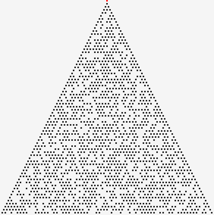
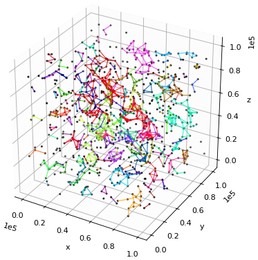
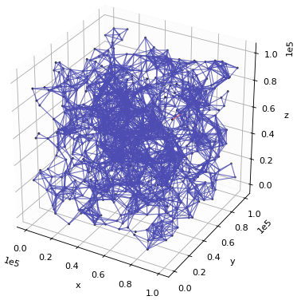
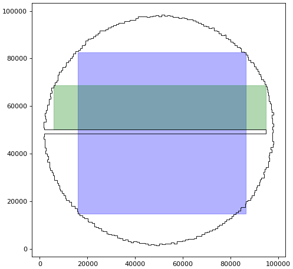
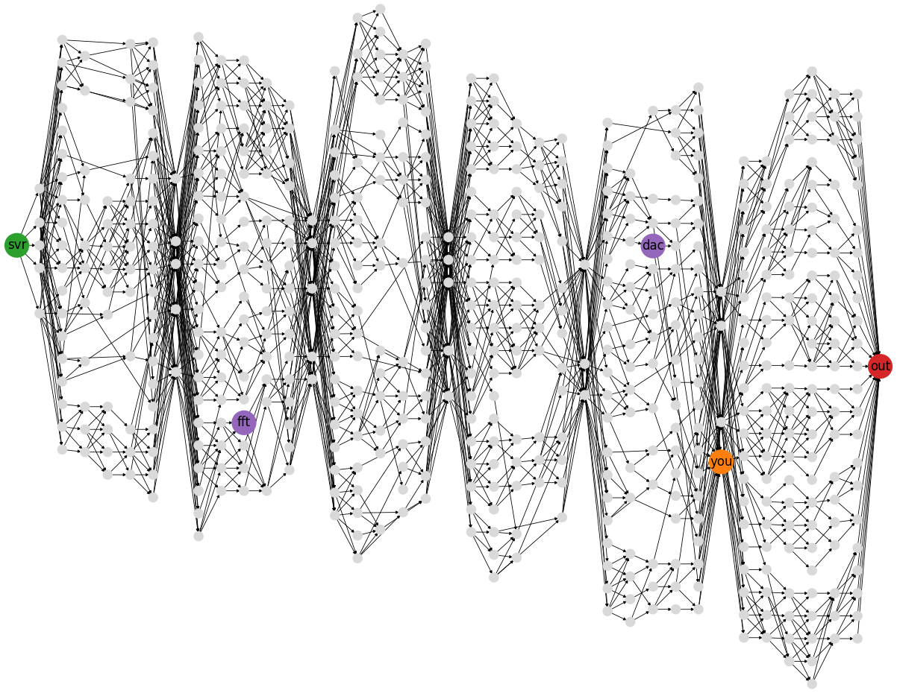

# Advent of code 2025

[[**Open the notebook in Colab**]](https://colab.research.google.com/github/hhoppe/advent_of_code/blob/main/2025/advent_of_code_2025.ipynb)

Jupyter [notebook](https://github.com/hhoppe/advent_of_code/blob/main/2025/advent_of_code_2025.ipynb)
with Python solutions to the
[2025 Advent of Code puzzles](https://adventofcode.com/2025),
completed in December 2025,
by [Hugues Hoppe](https://hhoppe.com/).

The notebook presents both "compact" and "fast" code versions, along with data visualizations.

For the fast solutions, the cumulative time across all 12 puzzles is less than 0.5 s on my PC. 
(Some solutions use the `numba` package to jit-compile functions, which can take a few seconds.)

 <a href="#https://nbviewer.org/github/hhoppe/advent_of_code/blob/main/2025/advent_of_code_2025.ipynb#day4">day4</a>
 &emsp;
 <a href="#https://nbviewer.org/github/hhoppe/advent_of_code/blob/main/2025/advent_of_code_2025.ipynb#day7">day7</a>
 &emsp;

 <a href="#https://nbviewer.org/github/hhoppe/advent_of_code/blob/main/2025/advent_of_code_2025.ipynb#day8">day8</a>
 &nbsp;
 &emsp;
 <a href="#https://nbviewer.org/github/hhoppe/advent_of_code/blob/main/2025/advent_of_code_2025.ipynb#day9">day9</a>
 

 <a href="#https://nbviewer.org/github/hhoppe/advent_of_code/blob/main/2025/advent_of_code_2025.ipynb#day11">day11</a>
 

