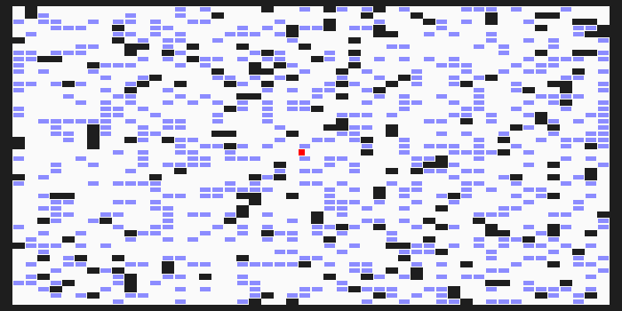
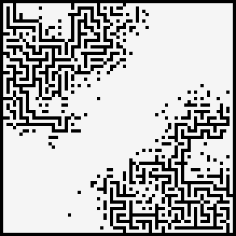

# Advent of code

Jupyter notebooks by [Hugues Hoppe](http://hhoppe.com/) with Python solutions to the
[Advent of Code puzzles](https://adventofcode.com/).

We explore both "compact" and "fast" code versions, along with data visualizations.

Open each notebook in Colab:
[[**2024**]](https://colab.research.google.com/github/hhoppe/advent_of_code/blob/main/2024/advent_of_code_2024.ipynb)
[[**2023**]](https://colab.research.google.com/github/hhoppe/advent_of_code/blob/main/2023/advent_of_code_2023.ipynb)
[[**2022**]](https://colab.research.google.com/github/hhoppe/advent_of_code/blob/main/2022/advent_of_code_2022.ipynb)
[[**2021**]](https://colab.research.google.com/github/hhoppe/advent_of_code/blob/main/2021/advent_of_code_2021.ipynb)
[[**2020**]](https://colab.research.google.com/github/hhoppe/advent_of_code/blob/main/2020/advent_of_code_2020.ipynb)
[[**2019**]](https://colab.research.google.com/github/hhoppe/advent_of_code/blob/main/2019/advent_of_code_2019.ipynb)
[[**2018**]](https://colab.research.google.com/github/hhoppe/advent_of_code/blob/main/2018/advent_of_code_2018.ipynb)
[[**2017**]](https://colab.research.google.com/github/hhoppe/advent_of_code/blob/main/2017/advent_of_code_2017.ipynb)
[[**2016**]](https://colab.research.google.com/github/hhoppe/advent_of_code/blob/main/2016/advent_of_code_2016.ipynb)
[[**2015**]](https://colab.research.google.com/github/hhoppe/advent_of_code/blob/main/2015/advent_of_code_2015.ipynb)

Open each notebook in GitHub:
[[**2024**]](https://github.com/hhoppe/advent_of_code/blob/main/2024/advent_of_code_2024.ipynb)
[[**2023**]](https://github.com/hhoppe/advent_of_code/blob/main/2023/advent_of_code_2023.ipynb)
[[**2022**]](https://github.com/hhoppe/advent_of_code/blob/main/2022/advent_of_code_2022.ipynb)
[[**2021**]](https://github.com/hhoppe/advent_of_code/blob/main/2021/advent_of_code_2021.ipynb)
[[**2020**]](https://github.com/hhoppe/advent_of_code/blob/main/2020/advent_of_code_2020.ipynb)
[[**2019**]](https://github.com/hhoppe/advent_of_code/blob/main/2019/advent_of_code_2019.ipynb)
[[**2018**]](https://github.com/hhoppe/advent_of_code/blob/main/2018/advent_of_code_2018.ipynb)
[[**2017**]](https://github.com/hhoppe/advent_of_code/blob/main/2017/advent_of_code_2017.ipynb)
[[**2016**]](https://github.com/hhoppe/advent_of_code/blob/main/2016/advent_of_code_2016.ipynb)
[[**2015**]](https://github.com/hhoppe/advent_of_code/blob/main/2015/advent_of_code_2015.ipynb)

Here are recent visualization results from
[**2024**](https://github.com/hhoppe/advent_of_code/blob/main/2024/advent_of_code_2024.ipynb):

&emsp;
&emsp;
&emsp;
&emsp;
&emsp;
&emsp;
&emsp;
&emsp;
&emsp;
&emsp;
&emsp;
&emsp;

